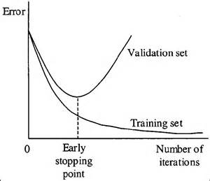

<h2>Methods to overcome Overfitting </h2>
<ol>   How to prevent:
<li>Cross-validation</li>
<li>Remove features</li>
<li>Early Stopping</li>
<li>Regularization</li>
<li>Ensembling</li>
<li>Hold out </li>
<li>Data Augmentation</li>
<li>Drop out</li>
</ol>
<h4>Cross-validation:</h4>

Cross-validation is a powerful preventative method for overfitting . To overcome overfitting we can split our dataset into k groups
(K-fold Cross-validation).We let one of the groupsto be the testing set
and others as training set. We repeat this until each individual
group has been used as testing set 

<h4>Remove features:</h4>

If we have large amount of features in our dataset,we should just use most important features 
for training.  We should remove unnecessary features which can be cause of overfitting. 

<h4>Early Stopping:</h4>

We can first train our model for an arbitrary large number of
epochs and plot the validation loss graph. Once validation loss
start to degrade, we stop to train our model . It can be implemented 
by monitoring loss graph or set an early stopping trigger. 

Early Stopping Graph 

<h4>Regularization:</h4>

It is technique to constrain network from learning complex model
which may therefore overfit. We can add penalty terms on cost function to push estimated coefficients towards zero.
We normally use L2 regularization which allows weights to push to zero but not exactly zero.

L2 Regularization:

<h3>Cost Function = Loss + λ/2m * ∑<var>||w||2</var></h3>

L1 Regularization:

<h3>Cost Function = Loss + λ/2m * ∑||w||</h3>

lambda is the regularization parameter. It is the hyperparameter whose value is optimized for better results.

 
<h4>Ensembling:</h4>

This technique is used to overcome overfitting.Mainly it creates multiple models
and combine them to produce more accurate results. Obviously it is better than single model. 

<h4>Hold out: </h4>

Rather than using full dataset we can simply split our dataset into test set and train set.
We normally follow common split ratio -80%(training set) and 20%(testing set).We train our model until it performs well not only training set but also for testing set.This approach would require
an enough large dataset to train on even after splitting  .

<h4>Data Augmentation:</h4>

It won't work every time but training with more data can be helpful for algorithms to detect signal better.A large dataset may reduce the chance of overfitting . 
If we are unable to gather more data and are constrained to the data we have in dataset,we can apply data augmentation artificially increase the dataset size.Like when we train our image dataset, we can rotate,flip, rescale, shift our same image and add with original dataset. 

<h4>Dropout:</h4>

By applying dropout to our layers, we just ignore a subset of units of our networkwith a set probability. 
We can reduce interdependent learning among units, which can be cause of overfitting. 
With dropout, we need more epochs for our model to converge.

